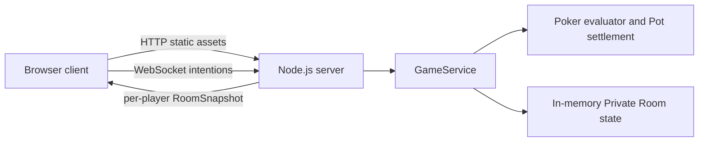

# Architecture Overview

## Shape

The MVP is a single-context web game with two workspaces:

- `client` — React + TypeScript browser UI.
- `server` — Node.js + TypeScript HTTP and WebSocket runtime.

The production container serves the built client from the server process and handles HTTP API and WebSocket traffic on the same port.

## Runtime flow

## Server-authoritative seam

`GameService` is the main public seam for domain behavior:

- creates and joins Private Rooms;
- starts Hands when room conditions are met;
- validates player actions;
- advances Betting Rounds;
- settles Pots and Side Pots;
- handles AI Takeover Seat, Seat Reclaim, Host Removal, Short Reconnect, and Action Timeout;
- produces per-player `RoomSnapshot` objects with Card Visibility enforced.

Clients do not calculate cards, chips, action legality, or winners. They submit intentions and render snapshots.

## Poker rules module

`server/src/poker.ts` is deliberately pure:

- card and deck helpers;
- best-hand evaluation;
- hand comparison;
- Side Pot settlement.

This keeps the highest-risk rules testable without WebSocket or UI setup.

## WebSocket adapter

`server/src/index.ts` adapts WebSocket messages to `GameService` calls:

- `createRoom`;
- `joinRoom`;
- `reconnect`;
- `action`;
- `leave`;
- `removePlayer`.

It also schedules:

- delayed AI actions;
- 120-second Action Timeout;
- next-Hand start after settlement;
- stale disconnect cleanup.

## Current architectural trade-offs

- Room state is memory-only by ADR-0002.
- One process owns all active rooms.
- No database, Redis, queue, or horizontal scaling.
- This is appropriate for the target 2-core 2GB server and 10 active room / 50 human player capacity.

## Known future deepening opportunities

1. Extract a scheduler module if timer behavior grows beyond AI actions, Action Timeout, next-Hand start, and Room Expiration.
2. Extract a protocol package if client/server message types start drifting.
3. Add a persistence adapter only when long-term hand history or multi-instance deployment becomes a product requirement.
